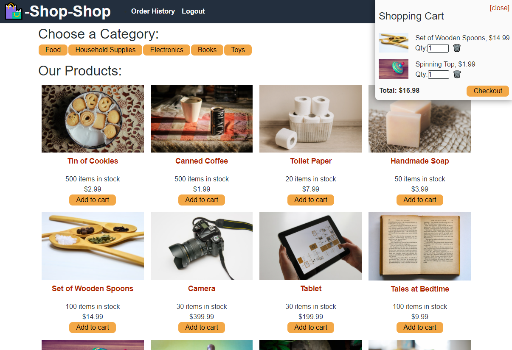

# redux-shop-shop-BC22-

# 🛍️-Shop-Shop-Redux

  
  
  
  

### Description
This project refactors a fictional e-commerce application to use Redux for global state control, paired with a React front end, Node.js and Express.js for the back-end server, and MongoDB for the database. Stripe is used for payments.  

# Table of Contents 
* [Summary](#description)
* [Tools Used](#tools)
* [Installation](#installation)
* [Heroku](#heroku)
* [Snapshot](#snapshot)
* [License](#license)
* [Contributing](#contributing)
* [Tests](#tests)
* [Questions](#questions)

## Installation
If you would like to modify the code, clone the project onto your computer, and run `npm install` in the root directory, in the client directory, and in the server directory.

From the root directory, type `npm start` to start the Express and GraphQL/Apollo servers. The homepage of the application will open in your default browser.

## Heroku
- [Heroku Deployment](https://budget-mcx.herokuapp.com/)

You can then see order history and test the shopping function. When you check out, you will be directed to a test mode Stripe storefront.

For testing purposes, `4242 4242 4242 4242` can be used as the credit card number with any future date for the expiration date and any three digits for the CVC.

## Screenshot

